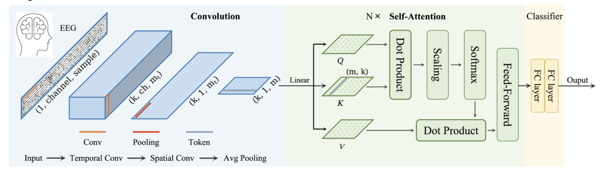
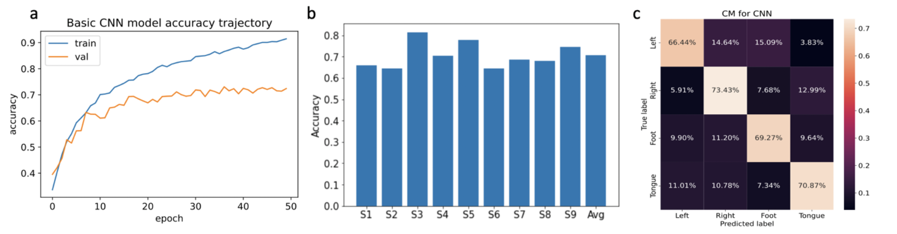
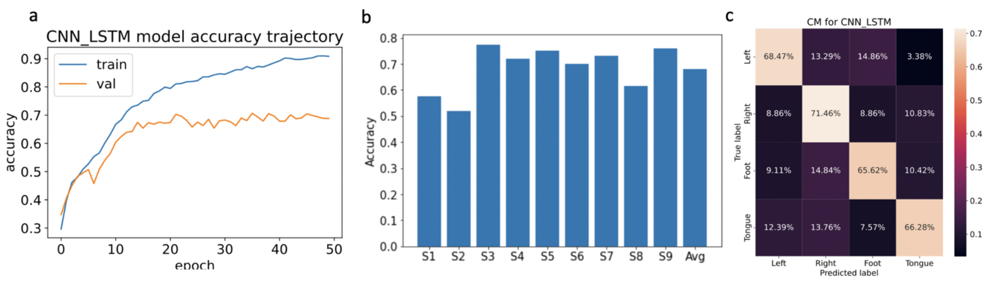
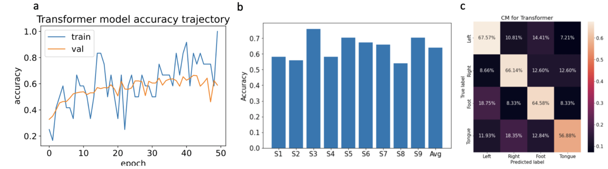

# DeepLearning-Brain-Interface-Classification
Electroencephalogram (EEG) motor imagery (MI) is among the most common brain–computer interface (BCI) paradigms used extensively in smart healthcare applications such as poststroke rehabilitation1. In this project, I built three deep learning models on the classification of MI-EEG signals, including convolutional neuron network (CNN), hybrid CNN-LSTM model and CNN-Transformer model. Interestingly, CNN has the best performance with accuracy of 0.7054 in rather confined training epochs among these three models, although the other two have more complicated architectures. For parameter tuning, it was found that learning rate decay, increasing the hidden units of LSTM and learning rate scheduling are generally helpful to increase the model accuracy.

## Dataset
The dataset is from BCI competition IV 2a, which consists of EEG data from 9 subjects (Sajda, P., Gerson, A., Muller, K.-R., Blankertz, B. & Parra, L. A data analysis competition to evaluate machine learning algorithms for use in brain-computer interfaces. IEEE Trans. Neural Syst. Rehabil. Eng. 11, 184–185 (2003).). The BCI paradigm consisted of four different MI tasks, namely the imagination of movement of the left hand (class 1), right hand (class 2), both feet (class 3), and tongue (class 4). Two sessions on different days were recorded for each subject. Each session contains 6 runs separated by short breaks. One run consists of 48 trials (12 for each of the four possible classes),
yielding a total of 288 trials per session. 22 EEG channels with 1000 time points are included for each data. Training data includes 2115 EEG signals with dimension of 2115 * 22 * 1000. Testing data contains 443 EEG signals with
dimension of 443 * 22 * 1000.

## Model architecture
For the basic CNN model, it contains 4 identical blocks. Each block contains a 2D convolutional layer, max pooling layer, batch norm layer and dropout of 0.5. The output layer is a FC layer with softmax for classification. For the CNN-LSTM model, the output layer is the FC layer followed by a LSTM layer and then softmax. For the CNN-Transfomer model, its architecture is shown below, which utilized attention mechanism to learn the spatial and temporal features of EEG signals. After common convolutions, spatial transforming was applied based on scaled dot-product attention evaluating the correlation between different channels. For temporal transforming, the data was divided into multiple slices with a shape of 1*d for attention training. Multihead attention is employed to allow the model to learn the dependencies from different angles.  
CNN-Transformer (Song, Y., Jia, X., Yang, L. & Xie, L. Transformer-based spatial-temporal feature learning for EEG decoding.
arXiv [eess.SP] (2021).)  
  

## Codes
eeg_classification.ipynb contains the main codes for data loading, data preprocessing, model construction and model evaluation for all thre models.

## Performance
The accuracy trajectory during training, average accuracy of individual subjects and confusion matrix of classification accuracy of each class are shown as a, b, c for all three models. Interestingly, CNN has the best performance with accuracy of 0.7054 in rather confined training epochs among these three models, although the other two have more complicated architectures.  
  
CNN  
  
CNN-LSTM  
  
CNN-Transformer  
  
